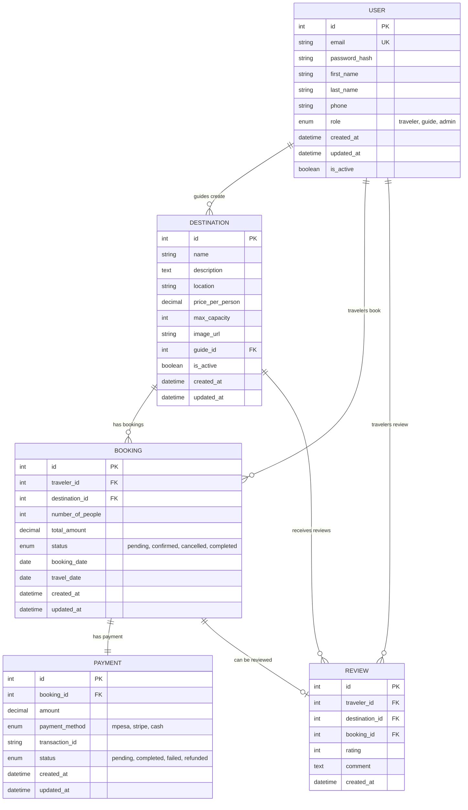

# SafariHub Backend - Entity Relationship Diagram

## Relationships Explained:

1. **USER to DESTINATION (1:Many)**
   - Guides (users with role='guide') can create multiple destinations
   - Each destination belongs to one guide

2. **USER to BOOKING (1:Many)**
   - Travelers (users with role='traveler') can make multiple bookings
   - Each booking belongs to one traveler

3. **DESTINATION to BOOKING (1:Many)**
   - Each destination can have multiple bookings
   - Each booking is for one destination

4. **BOOKING to PAYMENT (1:1)**
   - Each booking has exactly one payment record
   - Each payment belongs to one booking

5. **USER to REVIEW (1:Many)**
   - Travelers can write multiple reviews
   - Each review is written by one traveler

6. **DESTINATION to REVIEW (1:Many)**
   - Each destination can have multiple reviews
   - Each review is for one destination

7. **BOOKING to REVIEW (1:0..1)**
   - Each booking can optionally have one review
   - Each review is based on one booking

## Key Features:
- **Multi-role system**: Users can be travelers, guides, or admins
- **Booking management**: Track booking status and travel dates
- **Payment integration**: Support for M-Pesa, Stripe, and cash payments
- **Review system**: Travelers can rate and review destinations
- **Guide management**: Guides manage their own destinations